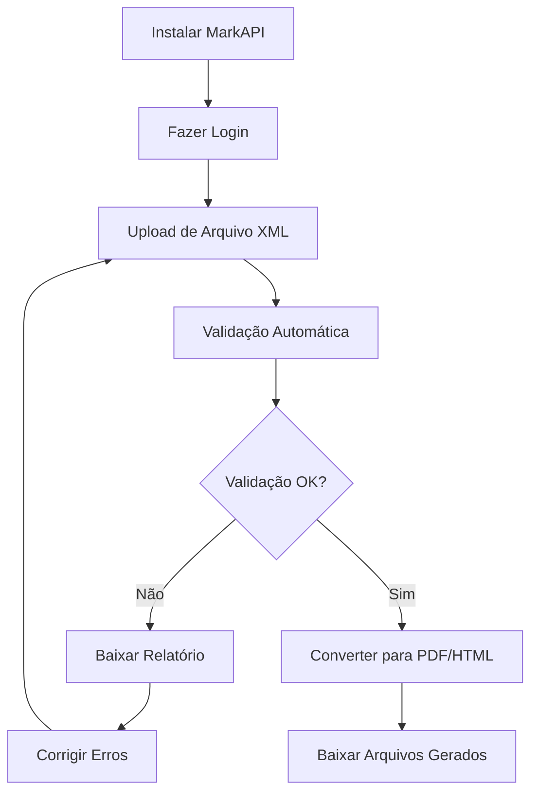

# Documentação do MarkAPI para Usuários Finais

Bem-vindo à documentação do MarkAPI! Este conjunto de guias foi criado para ajudar usuários finais (não desenvolvedores) a instalar, configurar e utilizar o MarkAPI para validar e converter documentos XML no padrão SciELO.

## Sobre o MarkAPI

O MarkAPI é uma aplicação web projetada para:

- **Validar** documentos XML de acordo com o padrão SciELO Publishing Schema (SPS)
- **Converter** XML para diferentes formatos (PDF, HTML, DOCX)
- **Processar** documentos em lote
- **Gerar relatórios** detalhados de validação

## Documentação Disponível

### Para Começar

#### 📘 [Guia de Instalação](./01-Installation-Guide.md)
Instruções completas para instalar o MarkAPI em seu servidor usando Docker.

**Inclui:**
- Pré-requisitos e instalação do Docker
- Passo a passo da instalação
- Configuração de variáveis de ambiente
- Solução de problemas comuns
- Comandos úteis para gerenciar a aplicação

**Público:** Administradores de sistema, usuários com conhecimento básico de terminal

---

### Usando o MarkAPI

#### ✅ [Guia de Validação de XML](./02-XML-Validation-Guide.md)
Como validar documentos XML usando o MarkAPI.

**Inclui:**
- Como fazer upload de arquivos XML
- Interpretar relatórios de validação
- Compreender níveis de severidade (ERROR, WARNING, INFO)
- Corrigir problemas e revalidar
- Boas práticas de validação
- Uso da API para validação automatizada

**Público:** Editores, revisores, usuários que trabalham com XML

---

### Guias Adicionais (Em Desenvolvimento)

Os seguintes guias estão planejados ou em desenvolvimento:

- **Guia de Conversão XML para PDF**: Como gerar PDFs a partir de arquivos XML
- **Guia de Conversão XML para HTML**: Como gerar versões web dos artigos
- **Configuração de Modelos DOCX**: Como personalizar o layout dos PDFs gerados
- **Processamento em Lote**: Como processar múltiplos arquivos simultaneamente

## Recursos Rápidos

### Links Úteis

- **Repositório GitHub**: https://github.com/scieloorg/markapi
- **Wiki do Projeto**: https://github.com/scieloorg/markapi/wiki
- **Issues e Suporte**: https://github.com/scieloorg/markapi/issues
- **Documentação SPS**: https://docs.scielo.org/

### Acesso Rápido

Após a instalação, você pode acessar:

- **Aplicação Web**: `http://seu-servidor:8000`
- **Painel Admin**: `http://seu-servidor:8000/django-admin/`
- **API**: `http://seu-servidor:8000/api/`
- **Documentação da API**: `http://seu-servidor:8000/api/docs/`

## Fluxo de Trabalho Típico

## Para Diferentes Tipos de Usuários

### 👨‍💼 Editores e Coordenadores

**Você deve ler:**
1. Visão geral deste README
2. Como fazer upload e validar XML (seções básicas do Guia de Validação)
3. Como interpretar relatórios de validação

**Você não precisa:**
- Instalar o MarkAPI (peça ao administrador de TI)
- Conhecer detalhes técnicos de Docker ou linha de comando

### 👨‍💻 Administradores de Sistema

**Você deve ler:**
1. Guia de Instalação completo
2. Seções de configuração e manutenção
3. Comandos úteis e solução de problemas

**Recursos adicionais:**
- README.md na raiz do projeto (documentação técnica)
- Documentação do Docker Compose
- Logs do sistema

### 📝 Autores e Revisores de Conteúdo

**Você deve ler:**
1. Como fazer upload de XML
2. Como interpretar erros de validação
3. Boas práticas de preparação de XML

**Foco em:**
- Qualidade do conteúdo XML
- Correção de erros de metadados
- Conformidade com padrões SciELO

## Perguntas Frequentes (FAQ)

### Instalação e Configuração

**Q: Preciso saber programar para usar o MarkAPI?**  
R: Não. Para usar a interface web, basta saber navegar em um site. Para instalar, é necessário conhecimento básico de terminal e Docker.

**Q: Posso instalar no Windows?**  
R: Sim, usando Docker Desktop. Siga as instruções no Guia de Instalação.

**Q: Quanto tempo leva a instalação?**  
R: Entre 30 minutos a 1 hora, dependendo da velocidade da internet e do computador.

**Q: Preciso de um servidor dedicado?**  
R: Não necessariamente. Pode usar seu próprio computador para testes, mas para produção recomenda-se um servidor.

### Uso e Validação

**Q: Que tipos de arquivo posso validar?**  
R: Arquivos XML no padrão SciELO Publishing Schema (SPS), baseado em JATS.

**Q: Há limite de tamanho para os arquivos?**  
R: Por padrão, 10 MB. O administrador pode ajustar esse limite.

**Q: Quanto tempo leva a validação?**  
R: Geralmente de alguns segundos a 2-3 minutos, dependendo do tamanho e complexidade do XML.

**Q: Os erros de validação impedem a conversão para PDF?**  
R: Erros críticos (ERROR) podem impedir. Avisos (WARNING) geralmente não impedem, mas devem ser revisados.

### Solução de Problemas

**Q: O que fazer se o upload falhar?**  
R: Verifique o tamanho do arquivo, sua conexão de internet e tente novamente. Se persistir, contate o administrador.

**Q: Como reportar um bug?**  
R: Abra um issue no GitHub: https://github.com/scieloorg/markapi/issues

**Q: Onde encontro exemplos de XML válidos?**  
R: No repositório SPS: https://github.com/scieloorg/scielo_publishing_schema

## Suporte e Comunidade

### Obter Ajuda

1. **Documentação**: Comece sempre consultando os guias
2. **Wiki**: Verifique a wiki para tutoriais e dicas: https://github.com/scieloorg/markapi/wiki
3. **Issues**: Pesquise issues existentes ou abra um novo: https://github.com/scieloorg/markapi/issues
4. **Contato Direto**: Entre em contato com a equipe SciELO através dos canais oficiais

### Contribuir

Você pode contribuir:
- Reportando bugs e problemas
- Sugerindo melhorias
- Compartilhando casos de uso
- Ajudando outros usuários
- Melhorando a documentação

## Licença e Créditos

**MarkAPI** é um projeto open-source desenvolvido por SciELO.

- **Licença**: GPLv3
- **Copyright**: SciELO
- **Repositório**: https://github.com/scieloorg/markapi

## Histórico de Atualizações

### Versão 1.0 (2025)
- Documentação inicial para usuários finais
- Guia de Instalação
- Guia de Validação de XML
- README da documentação do usuário

---

## Próximos Passos

Escolha o guia apropriado de acordo com sua necessidade:

1. **Novo no MarkAPI?** → Comece com o [Guia de Instalação](./01-Installation-Guide.md)
2. **Já instalado?** → Vá para o [Guia de Validação](./02-XML-Validation-Guide.md)
3. **Precisa de ajuda?** → Consulte a seção de Suporte acima

---

**Última atualização**: Outubro 2025  
**Versão da documentação**: 1.0  
**Compatível com MarkAPI**: 1.x
